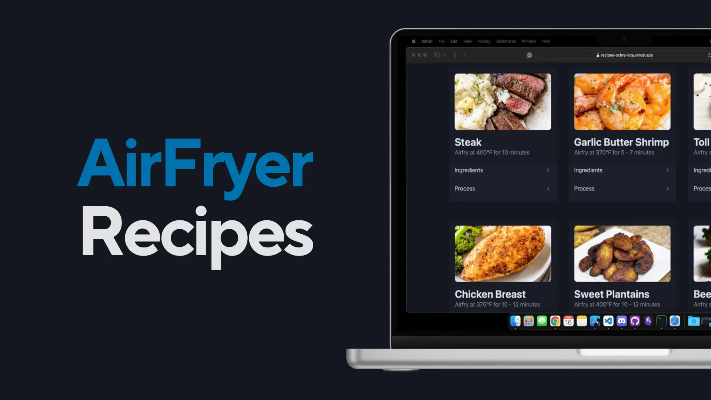

# Air Fryer Recipes



## Purpose

Bought my father an Air Fryer and he constantly struggles to remember the temperature and times for each food. I sticked an NFC tag unto the Air Fryer and linked it to this simple, small site that has all his favorite recipes.

This site can be used as a template for anyone that wants a simple way to reach their personal and family recipes in a quick and accessible manner while in the kitchen.

I'm using Preact + TypeScript + PicoCSS as frontend framework, Firestore as Database, Google Cloud Functions + Python as API. Recipes can be updated anytime using the Firebase dashboard as CMS, or through the API (coming soon).

## Setup

### Prerequisites

- [Node.js](https://nodejs.org/)
- [npm](https://www.npmjs.com/) (comes with Node.js)
- A Firebase project with Firestore and Google Cloud Functions enabled

### Cloning the Repository

1. Open your terminal or command prompt.
2. Clone the repository by running:

```
git clone https://github.com/Calesi19/Air-Fryer-Recipes.git
```

3. Navigate to the cloned directory:

```
cd air-fryer-arepas
```

### Installing Dependencies

1. Install the project dependencies by running:

```
npm i
```

### Setting up Firebase

1. Create a new Firebase project in the [Firebase Console](https://console.firebase.google.com/).
2. Enable Firestore and Google Cloud Functions in your Firebase project.

## Firestore Layout

- **Firestore**
  - **recipes** (Collection)
    - **autoID** (Document)
      - `name` (String)
      - `temperature` (String)
      - `time` (String)
      - `instructions` (String Array)
        - `step`
      - `ingredients` (String Array)
        - `ingredient`
      - `image` (String)
      - `video` (String)

## Set Up API

1. Go to your google cloud console.
2. Create a new Cloud Functions for each of the Python files in the API folder.
3. Upload the Python Code to those Cloud Functions.

### Running the Project Locally

1. Start the development server by running:

```
npm run dev
```

2. Open your browser and navigate to [http://localhost:5173](http://localhost:5173) to view the project.

